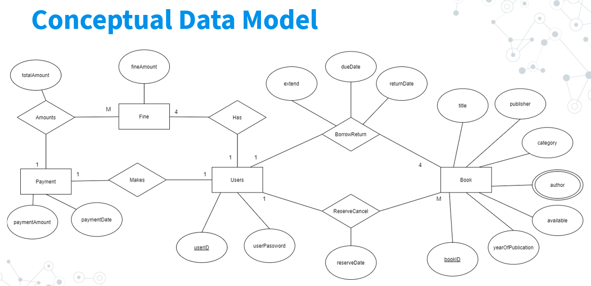

<h1 align="center">Integrated Library System </h1>

For our module on databases, we created this application to demonstrate our understanding of entity relationships.  
This simple Library System allows for users to borrow and reserve books, and an administrator role to monitor all transactions.  
The application was built using Django, and hosted using Google Cloud App Engine.

# Usage Cases

## Administrator

The administrator is able to view the reservations, bookings, and fines of all users.

## Users

Users will be able to reserve books, and borrow them.  
Overdue books will also incur fines to users automatically, and also delete all current reservations.  
Upon inccuring fines, they must pay them off before they are able to borrow and reserve again.

Furthermore, users can search for books, and filter based on the different attributes of the book.

# Implementation

ER Diagram and the Logical Data Model

